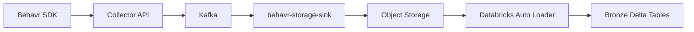

# Behavr Storage Sink

Standalone service that consumes validated behavioral events from Kafka topic `behavr.events.raw` and writes append-only newline-delimited JSON (`.jsonl`) to S3-compatible object storage. Kafka offsets are committed only after successful object writes.

## Why This Service Exists

The storage sink provides a durable raw landing zone for behavioral events.

Its responsibilities are intentionally limited to:

* consuming validated Kafka events
* batching records
* persisting append-only JSONL objects
* enabling replayable downstream lakehouse ingestion

Heavy analytics, deduplication, enrichment, and transformations are intentionally deferred to downstream processing layers.

## Architecture



Pipeline position:

```text
Behavr JS SDK → Collector API → Kafka (behavr.events.raw) → behavr-storage-sink → JSONL in object storage → Auto Loader → Bronze Delta
```

## Stack

* Java 21, Spring Boot 4.x
* Spring for Apache Kafka (batch listener, manual ack)
* AWS SDK v2 (S3-compatible object storage)
* Jackson (Spring Boot `tools.jackson` stack)
* Actuator (health, Prometheus)
* Maven, Docker Compose (this repo: **MinIO only**; Kafka is expected from **behavr-api** locally)

## Local development with behavr-api (recommended)

Yes — **behavr-api can publish to Kafka and this service consumes** the same topic, as long as both use the same bootstrap servers and topic name (default `behavr.events.raw`, `localhost:9092`).

1. **Start behavr-api** Docker Compose first (its Kafka on **9092**, Kafka UI on **8081**, same listener layout as in the collector repo).

2. **Start object storage** from this repo (MinIO only — does not start a second Kafka):

   ```bash
   docker compose up -d
   ```

3. **Run the collector API** so it can ingest HTTP traffic and produce to Kafka (if you are exercising the full path).

4. **Run the storage sink** with profile `local`:

   ```bash
   ./mvnw spring-boot:run -Dspring-boot.run.profiles=local
   ```

   Spring Boot Docker Compose will start **only** the services in `compose.yaml` here (MinIO + bucket init). Kafka is whatever is already listening on `localhost:9092` (from behavr-api).

5. Confirm **MinIO** console at [http://localhost:9011](http://localhost:9011) (S3 API on **9010**) — bucket `behavr-lake`, keys like:

   ```text
   raw/events/site_id={site_id}/date={yyyy-MM-dd}/hour={HH}/events_{yyyyMMddTHHmmssZ}_{uuid8}.jsonl
   ```

Use **Kafka UI** from behavr-api (port **8081**) to inspect `behavr.events.raw` and consumer group `behavr-storage-sink`.

## Local development without behavr-api (Kafka overlay)

If you do not have behavr-api running but still want a broker, use the optional overlay (same **bitnamilegacy/kafka** pattern as behavr-api). **Do not** run this while behavr-api Kafka is already using **9092** / **8081**.

```bash
docker compose -f compose.yaml -f compose.kafka-standalone.yaml up -d
```

| Service              | Port (standalone overlay) |
| -------------------- | ------------------------- |
| Kafka                | 9092                      |
| Kafka UI             | 8081                      |
| MinIO API (host)     | 9010 → container 9000     |
| MinIO Console (host) | 9011 → container 9001     |

## Configuration

Main knobs (see `src/main/resources/application.yml`):

| Prefix               | Purpose                                                                                                                                                  |
| -------------------- | -------------------------------------------------------------------------------------------------------------------------------------------------------- |
| `spring.kafka.*`     | Bootstrap servers (default `localhost:9092` — matches behavr-api host listener), consumer group `behavr-storage-sink`, `max.poll.records`, deserializers |
| `behavr.kafka.topic` | Topic name (default `behavr.events.raw` — must match the collector / API producer)                                                                       |
| `behavr.sink.*`      | Bucket, key prefix, `max-events-per-file`, `flush-interval`, `max-buffer-bytes`                                                                          |
| `behavr.storage.*`   | Region, optional `endpoint` (MinIO), `path-style-access`, optional static keys (empty in prod → IAM / default chain)                                     |

Production profile `prod` disables path-style access by default; set `behavr.storage.endpoint` empty for AWS.

## Production (Confluent + AWS) via `.env`

1. Copy the template and fill in secrets (file is gitignored):

   ```bash
   cp .env.example .env
   ```

2. Set variables in `.env` (Java **Properties** format: `KEY=value`, one per line, no `export` prefix). With profile **`prod`**, Spring imports optional `file:.env[.properties]` from the **process working directory** (usually the project root when using `./mvnw`).

   | Variable                                      | Purpose                                                         |
      | --------------------------------------------- | --------------------------------------------------------------- |
   | `CONFLUENT_BOOTSTRAP_SERVERS`                 | Confluent bootstrap servers                                     |
   | `CONFLUENT_API_KEY`                           | SASL/PLAIN username                                             |
   | `CONFLUENT_API_SECRET`                        | SASL/PLAIN password                                             |
   | `BEHAVR_SINK_BUCKET`                          | S3 bucket name (default `behavr-lake` if unset)                 |
   | `BEHAVR_SINK_PREFIX`                          | Key prefix (default `raw/events`)                               |
   | `AWS_REGION`                                  | Region for S3 and `behavr.storage.region` (default `us-east-1`) |
   | `AWS_ACCESS_KEY_ID` / `AWS_SECRET_ACCESS_KEY` | Optional static keys; leave empty on EC2/EKS for IAM            |

3. Run with `prod` (and no `local`):

   ```bash
   ./mvnw spring-boot:run -Dspring-boot.run.profiles=prod
   ```

If `CONFLUENT_API_SECRET` contains characters that break Properties parsing (`=`, `#`, etc.), set credentials only via the real environment (or escape per Java Properties rules) instead of putting them in `.env`.

You can also omit `.env` and export the same variable names in the shell or inject them in Kubernetes / Docker `env_file`.

## Health and metrics

* Health: `GET /actuator/health` (includes contributor `objectStorage` for bucket head check).
* Prometheus: `GET /actuator/prometheus` (counters such as `behavr_storage_sink_records_consumed_total`).

## Testing

```bash
./mvnw test
```

Unit tests use an embedded Kafka broker; they do not require behavr-api or `compose.yaml`.

## Message contract

Aligned with the collector producer:

* topic: `behavr.events.raw`
* string key: `siteId + ":" + eventId`
* one JSON object per record
* camelCase payloads
* unknown properties ignored on the `CollectedEvent` DTO

See:

```text
docs/downstream-kafka-consumer-guide.md
```

## Design Principles

* Kafka is the replay and durability backbone.
* Raw storage is append-only.
* The sink remains stateless and horizontally scalable.
* Deduplication happens downstream.
* Storage layout is optimized for lakehouse ingestion.
* Object storage abstraction is vendor-neutral.
* Analytics and transformations are intentionally excluded from the sink layer.

## Long-Term Platform Vision

The storage sink is a foundational component of the Behavr event-driven data platform:

```text
SDK → ingestion → Kafka → raw object storage → lakehouse → realtime analytics → recommendations
```

Future downstream components:

* Databricks bronze/silver/gold pipelines
* ClickHouse realtime analytics
* recommendation engine
* behavioral intelligence APIs
* multi-tenant analytics platform

## License

Licensed under the Apache License 2.0.

See `LICENSE` for details.
