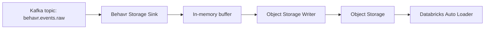
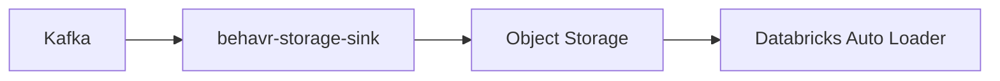

# Behavr Storage Sink
## Technical Development Specification

This document is a development specification of the **Behavr Storage Sink** service.

The service consumes validated behavioral events from Kafka and writes them as newline-delimited JSON files (`.jsonl`) to object storage.

Supported storage targets:

- local development: MinIO
- production: AWS S3
- future:
  - Google Cloud Storage (GCS)
  - Azure Data Lake Storage (ADLS)
  - Cloudflare R2
  - S3-compatible object stores

---

# 1. Project Goal

Build a standalone service:

```text
behavr-storage-sink
```

Its purpose is to persist raw event streams from Kafka into durable object storage.

The service is part of the Behavr platform:

```text
Behavr JS SDK
  → Collector API
  → Kafka topic: behavr.events.raw
  → Behavr Storage Sink
  → Object Storage raw JSONL files
  → Databricks Auto Loader
  → Bronze Delta tables
```

The service must remain intentionally focused:

```text
consume → buffer → write JSONL object → commit Kafka offsets
```

It must NOT perform:
- analytics
- enrichment
- sessionization
- recommendation logic
- business transformations

---

# 2. Target Architecture



---

# 3. Technology Stack

Use:

- Java 21+
- Spring Boot 4.x or 3.x
- Spring for Apache Kafka
- AWS SDK v2
- Jackson
- Spring Boot Actuator
- Micrometer / Prometheus
- Lombok if available
- Maven
- Docker Compose for local Kafka + MinIO

Do NOT use:

- JPA
- relational databases
- Spark
- ClickHouse
- REST APIs beyond health/debug
- heavy transformation frameworks

This service is a Kafka-to-object-storage persistence layer.

---

# 4. Repository Name

Recommended repository name:

```text
behavr-storage-sink
```

Recommended package:

```text
net.behavr.storagesink
```

---

# 5. Core Responsibilities

The service must:

1. Consume events from Kafka topic `behavr.events.raw`
2. Deserialize messages as `CollectedEvent`
3. Group and buffer events by storage partition
4. Write newline-delimited JSON files to object storage
5. Generate deterministic object keys
6. Commit Kafka offsets only after successful object write
7. Retry failed object writes
8. Expose health checks and metrics
9. Support local MinIO and production cloud object storage

---

# 6. Input Kafka Topic

Default topic:

```text
behavr.events.raw
```

Configurable via:

```yaml
behavr:
  kafka:
    topic: behavr.events.raw
```

---

# 7. Output Format

Write newline-delimited JSON:

```text
{"event_id":"...","event_type":"search",...}
{"event_id":"...","event_type":"product_view",...}
{"event_id":"...","event_type":"purchase",...}
```

File extension:

```text
.jsonl
```

Future enhancement:

```text
.jsonl.gz
```

Compression is NOT required in the first iteration.

---

# 8. Storage Layout

Object key format:

```text
raw/events/site_id={site_id}/date={yyyy-MM-dd}/hour={HH}/events_{timestamp}_{uuid}.jsonl
```

Example:

```text
raw/events/site_id=site_123/date=2026-05-11/hour=20/events_20260511T200501Z_8b2f.jsonl
```

Partitioning must be based on:

```text
occurred_at
```

Fallback order:

1. `occurred_at`
2. `received_at`
3. Kafka consume time

---

# 9. Buffering Strategy

Do NOT write one object per event.

Use configurable buffering:

```yaml
behavr:
  sink:
    max-events-per-file: 1000
    flush-interval: 10s
    max-buffer-bytes: 5242880
```

Flush conditions:

- event count threshold reached
- byte threshold reached
- time threshold reached

Use:

- in-memory buffers
- scheduled flushing

No disk buffering required initially.

---

# 10. Buffer Partitioning

Group events by:

```text
site_id + date + hour
```

Example grouping key:

```text
site_123|2026-05-11|20
```

This ensures proper object partitioning.

---

# 11. Kafka Offset Strategy

Kafka offsets must ONLY be acknowledged after successful object storage writes.

Use:

```text
AckMode.MANUAL
```

Recommended implementation:

## Batch listener approach

1. Consume batch
2. Parse records
3. Group by partition
4. Write JSONL objects
5. Acknowledge batch after successful writes

Preferred for MVP simplicity.

---

# 12. Kafka Consumer Configuration

Suggested configuration:

```yaml
spring:
  kafka:
    consumer:
      group-id: behavr-storage-sink
      auto-offset-reset: earliest
      enable-auto-commit: false
      properties:
        max.poll.records: 1000
```

Example listener:

```java
@KafkaListener(
    topics = "${behavr.kafka.topic}",
    containerFactory = "batchKafkaListenerContainerFactory"
)
public void consume(List<ConsumerRecord<String, String>> records, Acknowledgment ack) {
    // process batch
}
```

---

# 13. Object Storage Abstraction

Create abstraction:

```text
ObjectStorageWriter
```

Methods:

```java
void write(String key, byte[] content, Map<String, String> metadata);
```

Implementations:

```text
S3ObjectStorageWriter
```

Future implementations:

```text
GcsObjectStorageWriter
AzureBlobObjectStorageWriter
```

The service name must remain storage-agnostic.

---

# 14. Object Metadata

Set metadata when possible:

| Metadata | Value |
|---|---|
| service | behavr-storage-sink |
| format | jsonl |
| event_count | N |

Content type:

```text
application/x-ndjson
```

---

# 15. Configuration

## BehavrKafkaProperties

```yaml
behavr:
  kafka:
    topic: behavr.events.raw
```

## BehavrSinkProperties

```yaml
behavr:
  sink:
    bucket: behavr-lake
    prefix: raw/events
    max-events-per-file: 1000
    flush-interval: 10s
    max-buffer-bytes: 5242880
```

## BehavrStorageProperties

```yaml
behavr:
  storage:
    region: us-east-1
    endpoint: http://localhost:9000
    path-style-access: true
    access-key: minioadmin
    secret-key: minioadmin
```

Production credentials should come from:
- IAM roles
- environment variables
- Kubernetes secrets

Never hardcode credentials.

---

# 16. Profiles

## local

Used for:
- Docker Compose Kafka
- MinIO
- local credentials
- path-style access

## prod

Used for:
- Confluent Cloud or production Kafka
- cloud object storage
- IAM/environment credentials

---

# 17. Docker Compose

Create local stack with:

- Kafka
- Kafka UI
- MinIO

Ports:

| Service | Port |
|---|---|
| Kafka | 9092 |
| Kafka UI | 8081 |
| MinIO API | 9000 |
| MinIO Console | 9001 |

Bucket:

```text
behavr-lake
```

---

# 18. Package Structure

Use:

```text
net.behavr.storagesink
  ├── config
  ├── kafka
  ├── model
  ├── service
  ├── storage
  ├── partition
  ├── metrics
  └── exception
```

---

# 19. Core Classes

## KafkaEventSinkListener

Responsibilities:
- consume Kafka batches
- delegate to sink service
- acknowledge after successful writes
- log failures

## EventSinkService

Responsibilities:
- deserialize records
- group records
- serialize JSONL
- write objects
- update metrics

## EventPartitioner

Responsibilities:
- compute partition keys

## ObjectKeyGenerator

Responsibilities:
- generate object paths

## ObjectStorageWriter

Storage abstraction.

## S3ObjectStorageWriter

AWS SDK implementation.

---

# 20. Validation Rules

Minimum required fields:

- event_id
- event_type
- site_id
- occurred_at

Malformed records:
- log
- increment metrics
- skip

Avoid infinite retries for poison records.

Future improvement:
- DLQ topic

Suggested future topic:

```text
behavr.events.dead_letter
```

---

# 21. Failure Handling

## Object storage write failure

If write fails:
- do NOT acknowledge Kafka batch
- throw exception
- allow Kafka retry

## Parse failure

Malformed records:
- skip
- continue batch

## Duplicate writes

Retries may produce duplicate raw files.

This is acceptable.

Deduplication happens downstream in Delta silver layer using:

```text
event_id
```

Raw storage is append-only.

---

# 22. Metrics

Recommended counters:

```text
behavr_storage_sink_records_consumed_total
behavr_storage_sink_records_written_total
behavr_storage_sink_records_malformed_total
behavr_storage_sink_files_written_total
behavr_storage_sink_write_errors_total
```

Avoid high-cardinality tags.

---

# 23. Logging

Log:
- batch sizes
- files written
- destination paths
- malformed record counts
- storage failures

Do NOT log full payloads by default.

---

# 24. Health Checks

Expose:

```text
/actuator/health
```

Optional:
- storage connectivity health
- Kafka consumer health
- Prometheus metrics

---

# 25. Testing Requirements

Create tests for:

## EventPartitioner
- partitioning
- UTC handling
- fallback timestamps

## ObjectKeyGenerator
- correct object path generation

## EventSinkService
- grouping logic
- JSONL serialization
- malformed record skipping

## Storage writer
- mocked object storage client

Optional:
- MinIO integration tests

---

# 26. Local Manual Test

1. Start Kafka + MinIO
2. Start `behavr-api`
3. Start `behavr-storage-sink`
4. Send events to Collector API
5. Confirm Kafka messages
6. Confirm JSONL objects in MinIO

Expected object path:

```text
raw/events/site_id=site_123/date=YYYY-MM-DD/hour=HH/events_*.jsonl
```

---

# 27. README Requirements

README must include:

- architecture diagram
- stack
- local setup
- MinIO usage
- configuration
- example object paths
- testing instructions

Include Mermaid diagram:



---

# 28. Acceptance Criteria

The task is complete when:

1. Application starts successfully
2. Kafka listener consumes batches
3. Valid events are written to object storage
4. Object keys follow partition format
5. Kafka offsets acknowledged after successful writes
6. Malformed records skipped safely
7. Metrics exposed
8. Health endpoint works
9. Unit tests pass
10. README documents local development

---

# 29. Future Work

Not part of this task:

- ClickHouse consumer
- Databricks pipelines
- Delta Lake writes
- Iceberg writes
- compression
- schema registry
- Avro/Protobuf
- exactly-once semantics
- object compaction
- DLQ implementation

This service only persists raw append-only JSONL files.

---

# 30. Design Principles

Follow these principles:

1. Keep the service simple
2. Keep the service stateless
3. Do not transform business data
4. Raw storage is append-only
5. Kafka is the replay mechanism
6. Storage is the durable landing zone
7. Deduplication happens downstream
8. Prefer readability over excessive abstractions
9. Keep object storage abstraction generic
10. Design for future multi-cloud support
